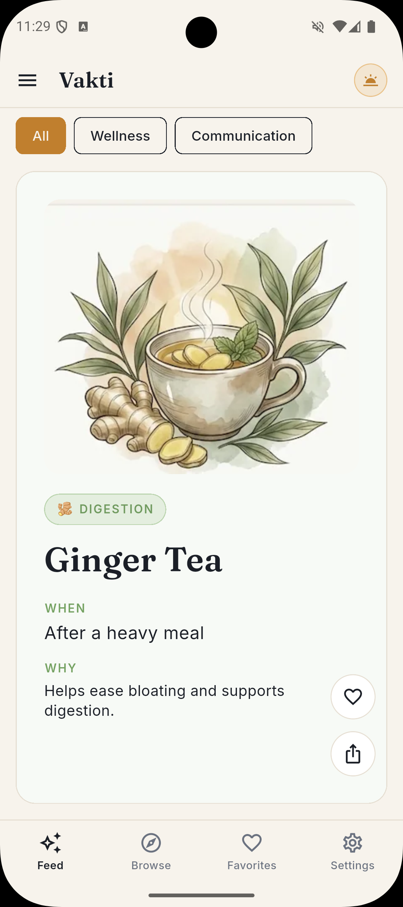
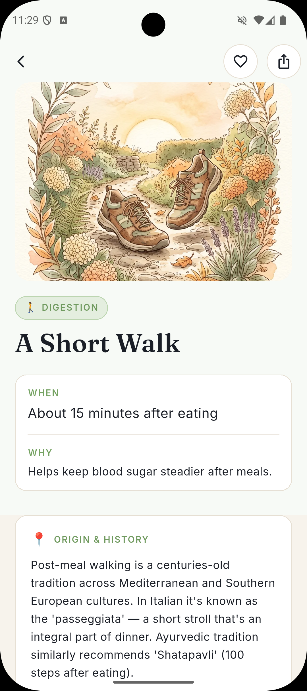
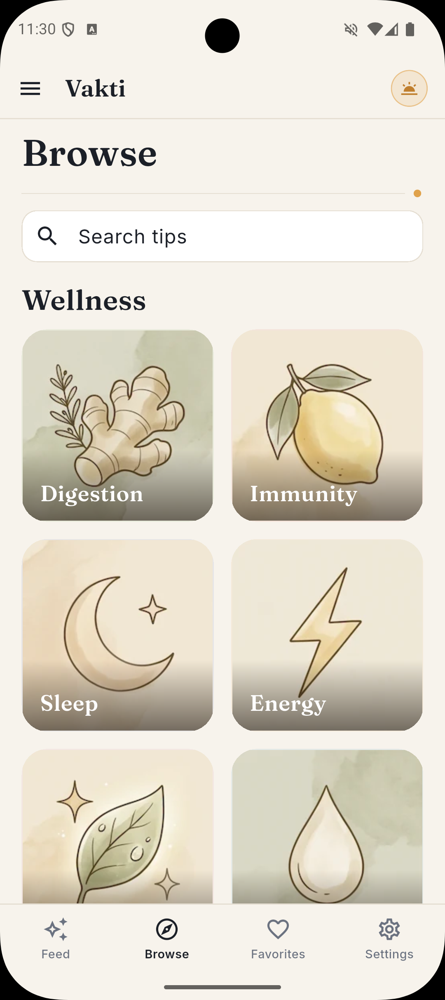
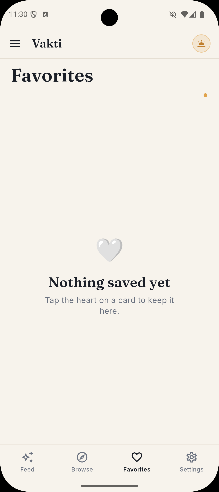

<div align="center">

<br />


<br /><br />

```
  ██╗   ██╗  █████╗  ██╗  ██╗ ████████╗ ██╗
  ██║   ██║ ██╔══██╗ ██║ ██╔╝ ╚══██╔══╝ ██║
  ██║   ██║ ███████║ █████╔╝     ██║    ██║
  ╚██╗ ██╔╝ ██╔══██║ ██╔═██╗     ██║    ██║
   ╚████╔╝  ██║  ██║ ██║  ██╗    ██║    ██║
    ╚═══╝   ╚═╝  ╚═╝ ╚═╝  ╚═╝    ╚═╝    ╚═╝
```

### **The right thing, at the right time** — premium, offline tip cards that answer *when* and *why*.

Free · Ad-free · Offline-first · Bilingual 🇹🇷 🇬🇧

[Report Bug](https://github.com/kutluhangil/VAKT-/issues) · [Request Feature](https://github.com/kutluhangil/VAKT-/issues)

</div>

---

## 🇹🇷 Türkçe Açıklama

**Vakti**, doğru bilgiyi doğru vakitte sunan ücretsiz, reklamsız ve tamamen **çevrimdışı** bir ipucu uygulamasıdır. Her kart sana sadece *ne* yapacağını değil, **ne zaman** ve **neden** yapacağını söyler. İki sakin başlık altında özenle hazırlanmış kısa bilgi kartları sunar: **Sağlıklı Yaşam** (sindirim, bağışıklık, uyku, enerji, cilt, hidrasyon) ve **İletişim** (sınır koyma, duygular, iş birliği, özgüven, bebek & ilk yıllar). Çift dilli (Türkçe + İngilizce, anında geçiş), golden-hour editöryel tasarım, **premium ana ekran widget'ı**, günlük seri (streak), arama ve ilgi alanına göre kişiselleştirilmiş akış. Backend yok, giriş yok, takip yok — tüm içerik cihazında.

---

## ✦ What is Vakti?

**Vakti** turns small, well-timed advice into a calm daily ritual. No feeds to doom-scroll, no ads, no account — just one premium tip card a day that tells you not only *what* to do, but **when** and **why**.

Two content pillars, carefully written and bilingual:

- 🌿 **Wellness** — digestion, immunity, sleep, energy, skin, hydration
- 💬 **Communication** — boundaries, emotions, cooperation, confidence, early years (parent ↔ child)

Everything ships inside the app. It works fully offline, on a plane, with airplane mode on, forever.

---

## ⚡ Features

| Feature | Description |
|--------|-------------|
| 🃏 **Tip Cards** | Editorial cards that answer *when* & *why*, not just *what* — with origin, how-to-use & a "did you know" |
| 🌗 **Two Pillars** | Wellness for everyday wellbeing · Communication for calmer parent–child moments |
| 📵 **Offline-First** | All content bundled. No internet, no backend, no login, ever |
| 🇹🇷🇬🇧 **Fully Bilingual** | Turkish & English, switch instantly — every card carries both languages |
| 🌅 **Premium Home Widget** | Golden-hour Android widget with the time-arc motif, category, date & streak chip |
| 🔥 **Daily Streak** | Consecutive-day tracking to build a gentle habit |
| 🔍 **Search** | Instant search across every tip, in both languages |
| ⭐ **Personalized Feed** | Pick your interests; matching categories rise to the top |
| 🔔 **Daily Reminder** | Optional, opt-in notification teasing the tip of the day |
| 💛 **Favorites** | Save any card and read it anytime |
| 🎨 **Golden-Hour Design** | Ink-dark & warm-paper themes, single saffron accent, signature "zaman yayı" arc |
| 🔒 **Privacy by Design** | No analytics, no ads, no data collected |

---

## 🖼️ Screenshots

<div align="center">

| | |
|:---:|:---:|
|  |  |
| **Feed** — Today's tip card, *when* & *why* | **Detail** — Origin, how-to-use & the story behind it |
|  |  |
| **Browse** — Search & tinted category grid | **Favorites** — Keep what matters |

</div>

---

## 🛠️ Tech Stack

```
Framework    →  Flutter 3.44 · Dart 3.12
State        →  Riverpod 3 (Notifier / NotifierProvider)
Routing      →  go_router (StatefulShellRoute bottom-nav shell)
Storage      →  Hive (settings, favorites, streak, interests) — on-device only
Widget       →  home_widget + native Android AppWidgetProvider (RemoteViews)
Background   →  workmanager (daily widget refresh, Android)
Notifications→  flutter_local_notifications v22 · timezone · flutter_timezone
Sharing      →  screenshot + share_plus (1080×1350 share card)
Review       →  in_app_review (native Play in-app review)
i18n         →  ARB + gen-l10n (TR + EN), no runtime google_fonts
Fonts        →  Fraunces (display) + Inter (body), bundled
Design       →  Editorial "golden hour" — ink/paper, saffron accent, time-arc motif
```

---

## 🚀 Getting Started

### Prerequisites

- Flutter `>= 3.44` · Dart `>= 3.12`
- Android SDK (Android Studio) for Android builds

### Local Development

```bash
# Clone
git clone https://github.com/kutluhangil/VAKT-.git
cd VAKT-

# Dependencies
flutter pub get

# Generate localizations (ARB -> Dart)
flutter gen-l10n

# App icons (optional, regenerates launcher icons)
dart run flutter_launcher_icons

# Run on a connected device / emulator
flutter run -d <device>
```

The app fetches **nothing** at runtime — all 88 tip cards live in `assets/data/tips.json`, so it runs out of the box with **zero configuration**, fully offline.

### Available Commands

| Command | Description |
|--------|-------------|
| `flutter pub get` | Install dependencies |
| `flutter gen-l10n` | Generate localized strings from ARB |
| `flutter test` | Run the test suite (24 tests) |
| `dart analyze lib test` | Static analysis (see gotcha below) |
| `flutter run -d <device>` | Launch on a device |
| `flutter build appbundle --release` | Build the Play Store `.aab` |

> ⚠️ **Gotcha:** `flutter analyze` crashes in this repo because the path contains the
> Turkish dotted `İ` (`/Volumes/ProjectVault/VAKTİ`), which corrupts the analysis-server
> `rootUri`. Use **`dart analyze lib test`** instead. `flutter test` is unaffected.
>
> QA shortcut: `--dart-define=SKIP_ONBOARDING=true` shows the feed without first-run onboarding.

---

## 📐 Project Structure

```
vakti/
├── lib/
│   ├── app/            # app.dart, router.dart, theme/ (colors, typography), controllers/
│   ├── data/
│   │   ├── models/     # tip, category, localized_text, content_pillar
│   │   ├── sources/    # asset_tip_source (JSON), local_store (Hive)
│   │   └── repositories/ # tip_repository, favorites_repository
│   ├── features/       # onboarding · feed · browse · detail · favorites · settings
│   ├── services/       # daily_tip · notification · widget · share · streak · review
│   ├── widgets/        # tip_card, time_arc, category_tile, pill_badge, ...
│   └── l10n/           # app_en.arb, app_tr.arb (+ generated)
├── assets/
│   ├── data/tips.json  # all 88 tip cards (bilingual, offline)
│   ├── images/         # card art, category icons, readme/
│   └── fonts/          # Fraunces, Inter
├── android/            # native widget (VaktiWidgetProvider.kt + res/), signing
├── docs/               # store_listing, store_listing_aso, ios_widget_setup
└── DEVELOPMENT_PLAN.md # roadmap
```

---

## 📊 How It Works

### Tip of the Day
The daily tip is chosen **deterministically from the date** (`yyyyMMdd % tips.length`),
so the app, the home-screen widget, and the daily notification all agree on the same
card — with no network and no server.

### Daily Streak
A pure, testable `StreakService` advances a consecutive-day counter once per app open
(same day = idempotent, yesterday = +1, a gap = reset to 1). Stored in Hive and mirrored
into the widget's "🔥 N" chip.

### Premium Android Widget
A native `AppWidgetProvider` renders a golden-hour card from data bridged by Flutter via
`home_widget`: emoji, category, localized date, the tip's *when* line and the streak chip.
Tapping it opens the app at the tip (`vakti://tip`).

### Privacy
No accounts, no ads, no analytics, no tracking. Settings and favorites never leave the
device. The Play *Data safety* form is "No data collected."

---

## ▶️ Google Play

Vakti targets the Google Play Store (Android first; iOS planned).

- **Package (applicationId):** `com.studiorosemary.vakti`
- **Format:** Android App Bundle (`.aab`)
- **Signing:** release keystore via `android/key.properties` + Play App Signing

### Build a release bundle

```bash
flutter build appbundle --release
# -> build/app/outputs/bundle/release/app-release.aab
```

Bump `version:` in `pubspec.yaml` (`name+code`, e.g. `1.1.0+2`) before each upload —
Play rejects a build that reuses an existing version code.

### 🧪 Closed Testing (the 14-day requirement)

New **personal** Google Play developer accounts must run a closed test before going to
production:

| Requirement | Detail |
|---|---|
| **Testers** | ≥ 12 opted-in testers who actually **install** the app |
| **Duration** | 14 continuous days of closed testing |
| **Then** | Apply for production access → promote the same build |

Tips:
- Collect testers via the opt-in URL (Play Console → Closed testing → Testers). A Google
  Group makes managing the list easy.
- Aim for **14–15 testers** in case someone drops off — the count only includes those who
  install and stay opted in.
- Reciprocal-testing communities (`r/GooglePlayTesting`, Telegram closed-testing groups)
  fill 12 spots quickly.

### Store listing & ASO

Optimized, copy-paste store metadata (TR + EN) lives in
[`docs/store_listing_aso.md`](docs/store_listing_aso.md): title, short & full description,
keyword strategy, screenshot captions and a pre-launch checklist.

---

## 🗺️ Roadmap

| Status | Feature |
|:-:|---|
| ✅ | MVP: feed, browse, detail, favorites, onboarding, settings, daily reminder |
| ✅ | 88 bilingual tip cards (TR + EN), fully offline |
| ✅ | Premium golden-hour Android home-screen widget |
| ✅ | Daily streak tracking |
| ✅ | Search across all tips |
| ✅ | Interest-based feed personalization |
| ✅ | In-app review prompt |
| 🔄 | Content expansion (88 → 150+ cards, new sub-themes) |
| 🔄 | Favorites → collections |
| ○ | Adult / partner communication content |
| ○ | AMOLED dark theme variant |
| ○ | Text-to-speech ("listen to the card") |
| ○ | iOS release + WidgetKit widget |
| ○ | Wear OS complication |

<sub>✅ Shipped &nbsp; · &nbsp; 🔄 In progress &nbsp; · &nbsp; ○ Planned</sub>

---

## 🤝 Contributing

Contributions are welcome — open an issue or a pull request.

1. Fork the repository
2. Create your feature branch (`git checkout -b feature/amazing-feature`)
3. Commit your changes (`git commit -m 'feat: add amazing feature'`)
4. Run `dart analyze lib test` and `flutter test` (keep them green)
5. Open a Pull Request

> Content must avoid clinical / absolute claims ("cures", "guarantees"). Keep the tone
> supportive and general; the in-app disclaimer applies.

---

## 📄 License

Distributed under the **MIT License**. See [`LICENSE`](LICENSE).

> Vakti's content is for general information only and is not a substitute for professional
> medical, psychological, or parenting advice.

---

<div align="center">

<br />

Built with ❤️ and a single saffron accent by [**Kutluhan Gil**](https://github.com/kutluhangil)

<br />

*If you find this useful, consider giving it a ⭐*

<br />

</div>
